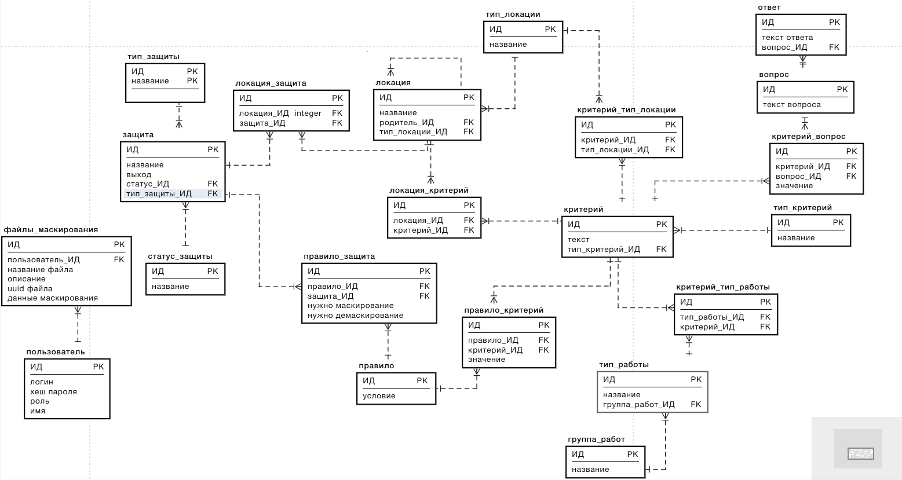

# Описание базы данных для проекта

## ссылка на базу данных
- Логическая: https://dbdesign.online/model/2HMDK2chR7Rf
- Физическая: https://dbdiagram.io/d/63e73b7a296d97641d802121

## Схема таблицы
Логическая схема БД

## Описание таблиц:
- пользователь: содержит информацию о пользователя зарегистрированных в системе
  - ИД - идентификатор пользователя
  - хеш_пароля
  - роль - может быть пользователь, эксперт, админ
- файлы_маскирования: содержит информацию о созданных картах маскирования
  - ИД
  - название файла
  - описание
  - uuid файла
  - данные маскирование: хранится в виде BLOB, содержит данные для 
формирования карты маскирования
- защита: содержит информацию о защитах установленных на объектах магистрального нефтепровода
  - ИД
  - название
  - выход: является защита выходом или нет: true - выход, false - вход
  - статус_ИД: 
  - тип_защиты_ИД: внешний ключ к таблице Тип защиты
- тип_защиты: содержит информацию о типах защиты: МПСА, ЦСПА, СОУ
  - ИД
  - название
- статус_защиты содержит информацию о статусе защиты
  - ИД
  - название
- тип_работы: содержит информацию о типах работ проводимых на объектах МН
  - ИД
  - название
  - группа_работ_ИД:
- группа_работ: информация о том, какой отдел выполняется работы или  как кому виду они относятся
  - ИД
  - название
- локация: Информация о том, на каких объектах возможно выполнять работы
  - ИД
  - защита_ИД
  - родитель_ИД - информация о том, к какой локации относится данная локация 
(Например: в каком помещении находится агрегат)
  - номер локации: идентификатор для нумерации объектов, чтобы они 
располагались в правильном порядке
- тип_локации: информация о типах локаций (ЛУ, НПС, МНА и т.д.)
  - ИД
  - название
- локация_защита: слабая сущность для соединения защит и локаций
  - ИД
  - защита_ИД
  - локация_ИД
- критерий: 
  - ИД
  - название
  - тип_критерий_ИД
- критерий_тип_локации: 
  - ИД
  - критерий_ИД
  - тип_локация_ИД
- критерий_локация:
  - ИД
  - критерий_ИД
  - локация_ИД
- критерий_тип_работы:
  - ИД
  - критерий_ИД
  - тип_работы_ИД
- правило:
  - ИД
  - условие
- правило_защита: 
  - ИД
  - правило_ИД
  - защита_ИД
  - нужно маскирование
  - нужно демаскирование
- правило_критерий: 
  - ИД
  - правило_ИД
  - критерий_ИД
  - значение
- вопрос: информация об уточняющих вопросах для формирования политики маскирования
  - ИД
  - текст: текст вопроса
- ответ: информация об ответах на вопросы
  - ИД
  - текст
  - вопрос_ИД
- тип_критерий: информация о типе критерия, в какую таблицу необходимо обратиться. В тип работы, локация или вопросы
  - ИД
  - название
- критерий_вопрос
  - ИД
  - критерий_ИД
  - вопрос_ИД
